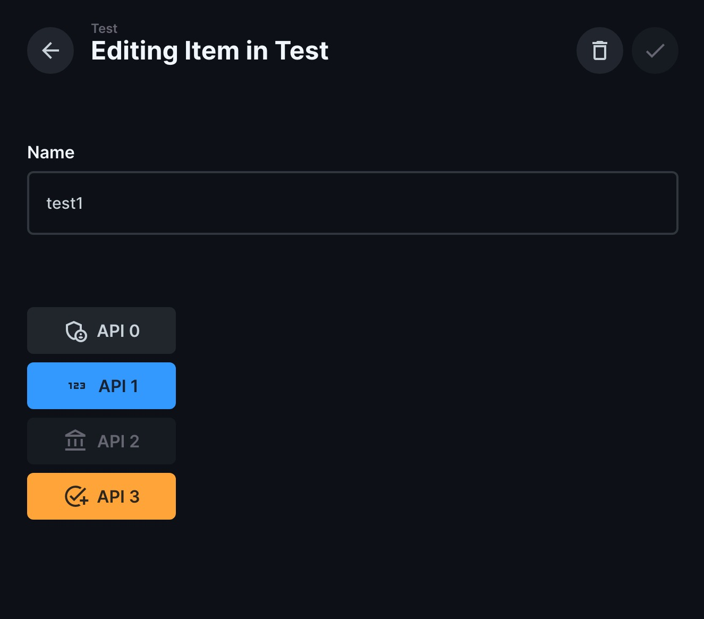

[](https://github.com/rezo-labs/directus-extension-api-trigger-interface/blob/main/LICENSE.txt)

# Introduction
A [Directus](https://github.com/directus/directus) interface extension for triggering API calls from the UI.

- **Support common HTTP methods**. GET, POST, PUT, PATCH, DELETE.
- **API calls are authenticated automatically**.
- **Dynamic URL**. Use [micromustache](https://github.com/userpixel/micromustache) to generate dynamic URL based on the current values of the item.
- **Disable trigger based on the current values of the item**.



# Installation
```
npm i directus-extension-api-trigger-interface
```

# Get Started
1. Go to **Settings**, create a new field with type alias.
2. In the **Interface** panel, choose **API Trigger** interface. There are 2 options:
    1. **Layout**: Display the button list vertically or horizontally.
    2. **Triggers**: A list of trigger.
        1. **Label**: label of the button
        2. **Size**: size of the button
        3. **Type**: style of the button
        4. **Icon**: icon of the button
        5. **URL**: API endpoint
        6. **Method**: Method of the API call
        7. **Reload**: If enabled, reload the browser if call succeeded
        8. **Disabled Conditions**: disable the button if the conditions are met.

# Limitation
- Only works for same domain APIs.

# TODO
- Allow to disable authentication.
- Call external APIs.
- Reduce budnle size.
